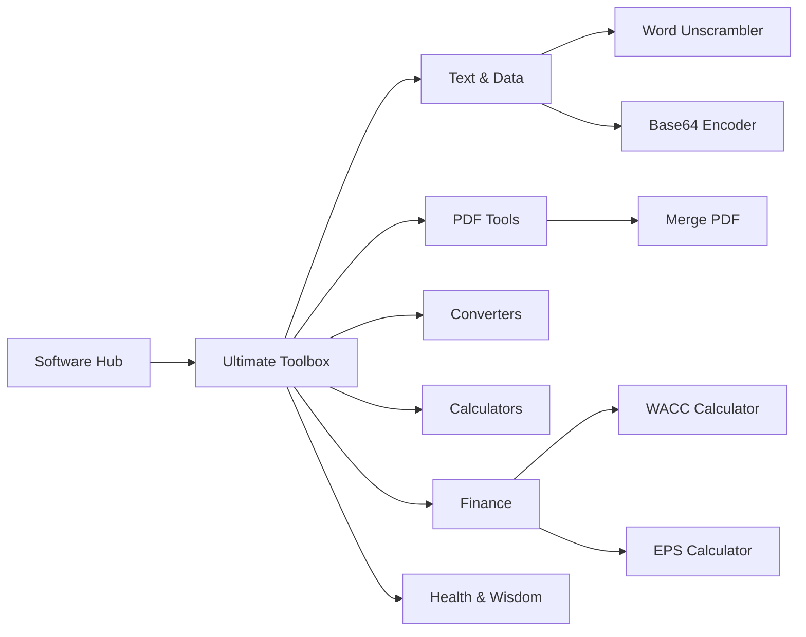

# Navigation Mockup: The "Triple-Nested Hub"

This mockup outlines the user experience for the deep navigation hierarchy requested. It is designed to be **AdSense-safe** by using a vertical fly-out pattern that keeps the user's mouse path predictable.

## 1. Visual Hierarchy (The Flow)



## 2. Desktop Interface Concept

### Level 1: The Header
When the user hovers **Software Hub**, a vertical pane appears.

### Level 2: The Main Pane
A card with high Z-index (`z-100`) showing:
> **Ultimate Toolbox**  → (Hover this to see categories)

### Level 3: The Fly-out
When hovering "Ultimate Toolbox", a second pane slides out to the right containing:
- **Finance**
- **Calculators**
- ... (and so on)

### Level 4: The Tool List
Hovering "Finance" reveals the 12 tools (EPS, WACC, etc.) in a neat grid.

---

## 3. Data Structure Update (Technical Plan)

I will reorganize the [NavigationMenu.tsx](file:///M:/techprojects/UtilitiesSite/packages/ui/src/NavigationMenu.tsx) data to match your requested tools perfectly:

```typescript
const NAVIGATION_DATA = {
  label: "Software Hub",
  submenu: {
    label: "Ultimate Toolbox",
    categories: [
      {
        name: "Text & Data",
        tools: ["Word Unscrambler", "Base64 Text Encoder", "MD5 Hash", "Word Count"]
      },
      {
        name: "Finance",
        tools: ["WACC Calculator", "EPS Calculator", "Currency Converter", "Loan Calculator", "Income Tax", "Compound Interest", "VAT & Tax Calculator", "Salary Converter", "Tip Calculator", "Retirement Planner", "Inflation Calculator", "Budget Planner"]
      },
      // ... all other categories listed in task
    ]
  }
}
```

## 4. Safety Guardrails
- **Click Protection**: The fly-out will have a **20px safety gutter** (invisible margin) so users don't accidentally hover over an ad while moving between nesting levels.
- **Visual Distinction**: Each nesting level will be slightly darker than the previous one to maintain context.
